Проектирую цифровые сервисы, которыми пользуются миллионы людей. Сейчас делаю сервисы для ФНС в [ГНИВЦ](https://gnivc.ru/) — на 65 миллионов пользователей.

Продукт, бренд и дизайн с AI. Портфолио собрано на Tilda с кастомным кодом: курсоры, сетка и анимации — свои.

**Языки:** английский B1, китайский HSK 3.

### Проекты

- [Telecom](http://oyourich.ru/telecominprogress)
- [Цифровая подпись](https://oyourich.ru/podpis)
- [Самозанятые](http://oyourich.ru/selfemployed)
- [Интеллектуальная система](http://oyourich.ru/system)
- [Эльбрус](https://oyourich.ru/elbrus/)
- [Pink Planet](https://oyourich.ru/pinkplanet)

Все работы — на [oyourich.ru](https://oyourich.ru).

### Связаться

[Telegram @oyourich](https://t.me/oyourich) / [резюме на hh.ru](https://hh.ru/resume/17efd32aff09957e920039ed1f423545697539) / [портфолио](https://oyourich.ru)
